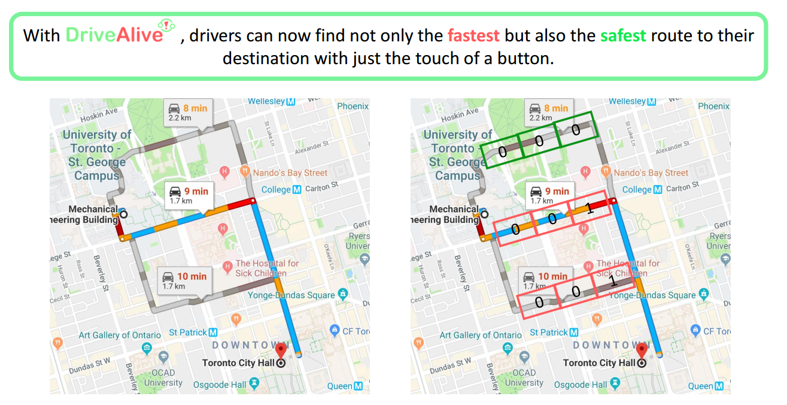
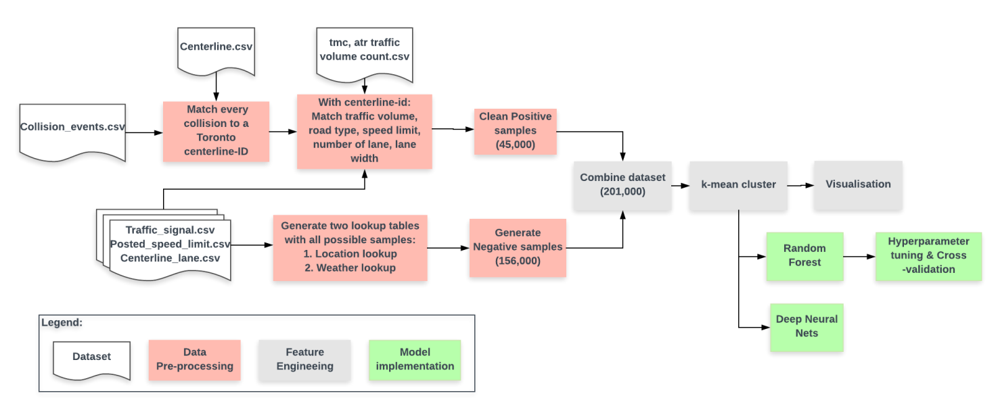
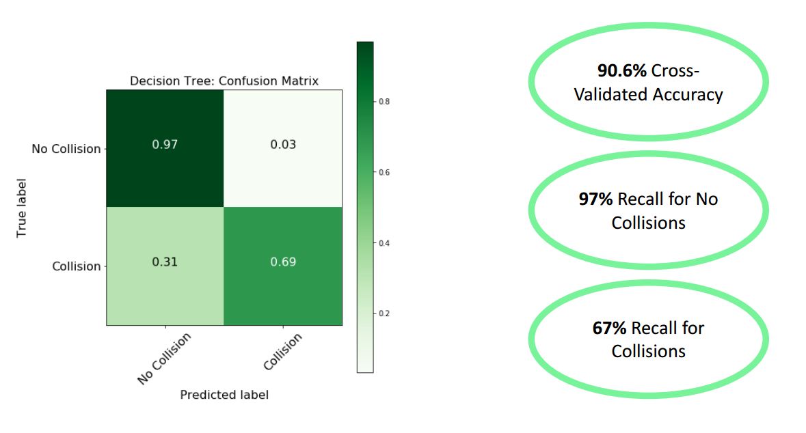

# Towards Smart Cities: Data-Driven Road Accident Prevention

- This project uses Traffic, Road, and Weather data to predict traffic accidents on road of Toronto.
- [DriveAlive_Presentation.pdf](DriveAlive_Presentation.pdf) contains the presentation slides that gives a overview of the project.
- [DriveAlive_Report.pdf](DriveAlive_Report.pdf) contains a detailed project report.
- [Toronto_Traffic_Accident_Prediction.ipynb](Toronto_Traffic_Accident_Prediction.ipynb) contains the analysis code.
- The datafiles are too large to be hosted in Github. Download from this OneDrive link: https://1drv.ms/u/s!Al12CN2e73-ogdBYcvALVRgP_nOW1g?e=hvOxrd

## Application

## Process

## Result

## Team Members

- [Amanda Aleong](https://www.linkedin.com/in/amanda-aleong-69869b98/)
- [Francis Cruz](https://github.com/franciscedriccruz)
- [Justin (Youngmok) Ko](https://www.linkedin.com/in/justinkoyoungm/?originalSubdomain=ca)
- [Shi Yu](https://github.com/LillyYu2019?tab=repositories)
- [Richard Hu](https://github.com/rhklite)
- [Hao Xing](https://www.linkedin.com/in/hao-xing-6707365a/?originalSubdomain=ca)

